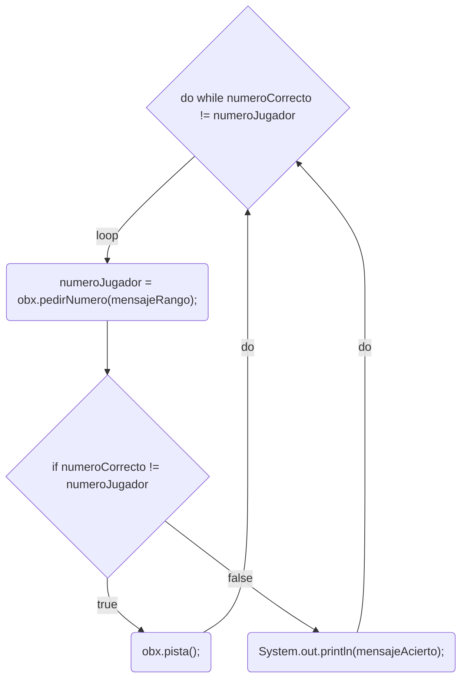

# Ejercicio 2 del boletin 12
En este boletin usaremos <b>diagramas de flujo</b> que nos serviran para <ins>enternder mejor nuestro codigo</ins>

```mermaid
graph TD
  froml2c8tol11c50{"do while numeroCorrecto != numeroJugador"}
  froml3c12tol3c58("numeroJugador = obx.pedirNumero(mensajeRango);")
  froml4c12tol9c13{"if numeroCorrecto != numeroJugador"}
  froml5c16tol5c28("obx.pista();")
  froml8c16tol8c51("System.out.println(mensajeAcierto);")
  froml5c16tol5c28 -- do --> froml2c8tol11c50
  froml8c16tol8c51 -- do --> froml2c8tol11c50
  froml2c8tol11c50 -- loop --> froml3c12tol3c58
  froml4c12tol9c13 -- true --> froml5c16tol5c28
  froml4c12tol9c13 -- false --> froml8c16tol8c51
  froml3c12tol3c58 --> froml4c12tol9c13
```